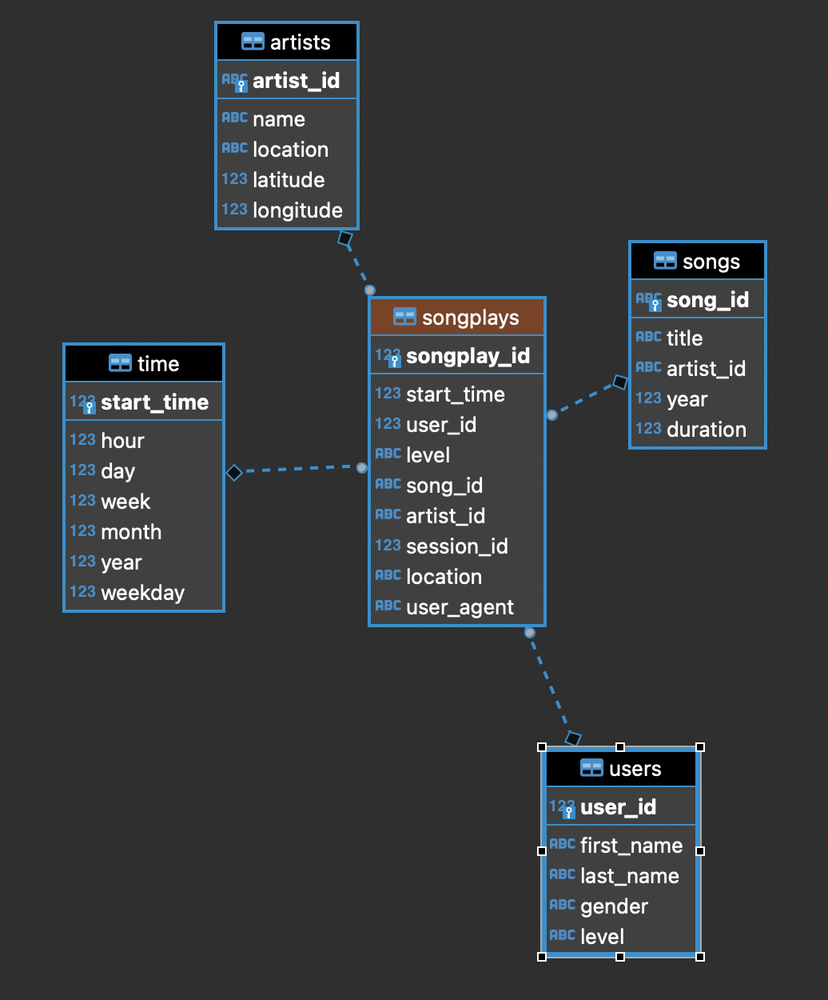

# Overview
This project demonstrates how to create a data pipeline with Apache Airflow. 
- Extract raw data from **S3** to **Redshift**
- Transform and loading from staging tables to dimension tables
- Perform data quality checks to monitor data pipeline and track data lineage

# Dataset
The [Million Song Dataset](http://millionsongdataset.com/) is a freely-available collection of audio features and metadata for a million contemporary popular music tracks.

# Directory structure

# Step to run
- Build project docker image

# Data pipeline

# Database schema

